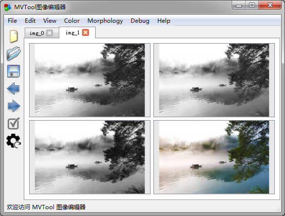

# MVTool 机器视觉编辑器

基于Python的图形图像处理工具。目标是实现以下特性：

- [x] 可复用的框架结构
    - [x] 基于Qt的DesktopApp
    - [ ] 基于Tornado的后端应用
    - [ ] 基于Vue的网页前端视图
- [x] 集成常用的项目工具：
    - [x] socket数据通讯
    - [x] HID设备通讯
    - [x] UndoStack
        - [x] 支持编辑的撤销与恢复
        - [x] 操作的序列化（导出脚本）
        - [ ] 操作的反序列化
    - [x] 日志
        - [x] 输出log文件
        - [x] 各文件独立level（便于调试）
        - [ ] level过滤器
        - [ ] Bug反馈系统
    - [x] 配置
        - [x] 可配置的用户操作习惯
        - [x] 可配置的menu（插件声明）
        - [ ] 系统的配置UI界面
        - [x] 多层级配置（系统、App、项目、user）
    - [x] 注册授权
        - [x] 单机授权
        - [x] 在线授权（服务端）
            - [x] 授权策略管理器
    - [ ] 编译
        - [x] pyc
        - [ ] pyd
    - [x] 打包
        - [x] 基于pyinstaller
        - [ ] 基于embed python
- [x] 便于拓展的插件体系
    - [x] 动态加载
    - [x] 运行时更新（便于调试）
    - [x] 可配置的menu菜单
- [x] Qt控件库
    - [x] canvas画布
    - [ ] BluePrint流程图
- [x] mvlib图像处理库：
    - [x] 多后端支持
        * pillow
        * numpy
        * opencv
        * scipy
        * skimage
    - [x] 脚本自动生成
    - [x] 预处理操作
        - [ ] 图像变换
        - [x] 形态学操作
        - [x] 颜色过滤
    - [ ] mvlib应用算子：
        - [ ] 模板匹配
        - [x] 轮廓操作
        - [ ] 连通域
        - [x] OCR识别
        - [ ] 视觉定位
        - [ ] 二维测量
        - [ ] 三维测量
        - [ ] 特征提取
        - [ ] 分类器
        - [ ] 边缘提取
        - [ ] 条码检测

由于本项目要实现的功能较多，模块功能尽可能独立仓库，以git子模块的方式集成。
